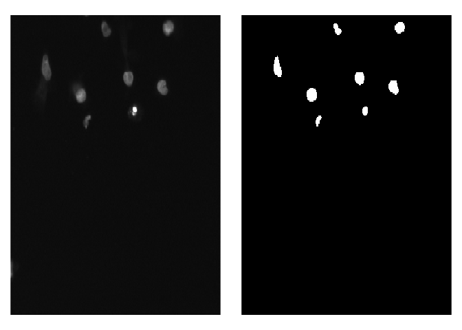

Download images and masks: [2018 Data Science
Bowl](https://www.kaggle.com/c/data-science-bowl-2018).

Build `U-Net` model and compile it with correct loss and metric:

``` r
library(tidyverse)
library(platypus)
library(abind)
library(here)

train_DCB2018_path <- here("development/data-science-bowl-2018/stage1_train")
test_DCB2018_path <- here("development/data-science-bowl-2018/stage1_test")

blocks <- 4 # Number of U-Net convolutional blocks
n_class <- 2 # Number of classes
net_h <- 256 # Must be in a form of 2^N
net_w <- 256 # Must be in a form of 2^N

DCB2018_u_net <- u_net(
  net_h = net_h,
  net_w = net_w,
  grayscale = FALSE,
  blocks = blocks,
  n_class = n_class,
  filters = 16,
  dropout = 0.1,
  batch_normalization = TRUE,
  kernel_initializer = "he_normal"
)

DCB2018_u_net %>%
  compile(
    optimizer = optimizer_adam(lr = 1e-3),
    loss = loss_dice(),
    metrics = metric_dice_coeff()
  )
```

Create data generator:

``` r
train_DCB2018_generator <- segmentation_generator(
  path = train_DCB2018_path, # directory with images and masks
  mode = "nested_dirs", # Each image with masks in separate folder
  colormap = binary_colormap,
  only_images = FALSE,
  net_h = net_h,
  net_w = net_w,
  grayscale = FALSE,
  scale = 1 / 255,
  batch_size = 32,
  shuffle = TRUE,
  subdirs = c("images", "masks") # Names of subdirs with images and masks
)
```

    ## 670 images with corresponding masks detected!
    ## Set 'steps_per_epoch' to: 21

Fit the model:

``` r
history <- DCB2018_u_net %>%
  fit_generator(
    train_DCB2018_generator,
    epochs = 20,
    steps_per_epoch = 21,
    callbacks = list(callback_model_checkpoint(
      "development/data-science-bowl-2018/DSB2018_w.hdf5",
      save_best_only = TRUE,
      save_weights_only = TRUE,
      monitor = "dice_coeff",
      mode = "max",
      verbose = 1)
    )
  )
```

Predict on new images:

``` r
DCB2018_u_net <- u_net(
  net_h = net_h,
  net_w = net_w,
  grayscale = FALSE,
  blocks = blocks,
  filters = 16,
  dropout = 0.1,
  batch_normalization = TRUE,
  kernel_initializer = "he_normal"
)
DCB2018_u_net %>% load_model_weights_hdf5(here("development/data-science-bowl-2018/DSB2018_w.hdf5"))

test_DCB2018_generator <- segmentation_generator(
  path = test_DCB2018_path, # directory with images and masks
  mode = "nested_dirs", # Each image with masks in separate folder
  colormap = binary_colormap,
  only_images = TRUE,
  net_h = net_h,
  net_w = net_w,
  grayscale = FALSE,
  scale = 1 / 255,
  batch_size = 32,
  shuffle = FALSE,
  subdirs = c("images", "masks") # Names of subdirs with images and masks
)
```

    ## 65 images detected!
    ## Set 'steps_per_epoch' to: 3

``` r
test_preds <- predict_generator(DCB2018_u_net, test_DCB2018_generator, 3)

test_masks <- get_masks(test_preds, binary_colormap)
```

Plot / save images with masks:

``` r
test_imgs_paths <- create_images_masks_paths(test_DCB2018_path, "nested_dirs", FALSE, c("images", "masks"), ";")$images_paths

plot_masks(
  images_paths = test_imgs_paths[1:4],
  masks = test_masks[1:4],
  labels = c("background", "nuclei"),
  colormap = binary_colormap
)
```

    ## Warning: The `x` argument of `as_tibble.matrix()` must have unique column names if `.name_repair` is omitted as of tibble 2.0.0.
    ## Using compatibility `.name_repair`.
    ## This warning is displayed once every 8 hours.
    ## Call `lifecycle::last_warnings()` to see where this warning was generated.


